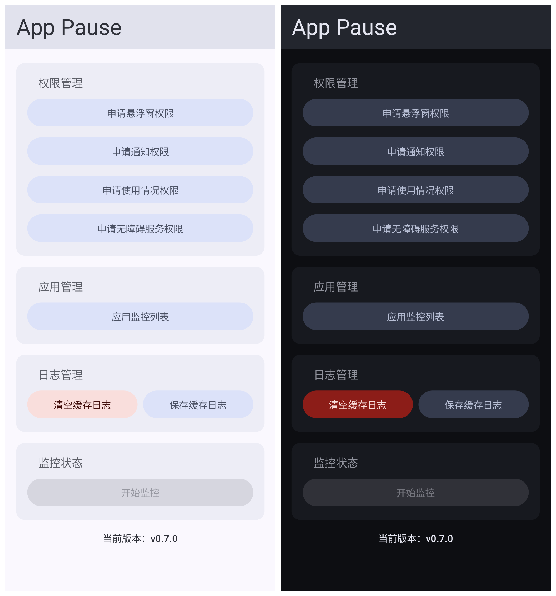
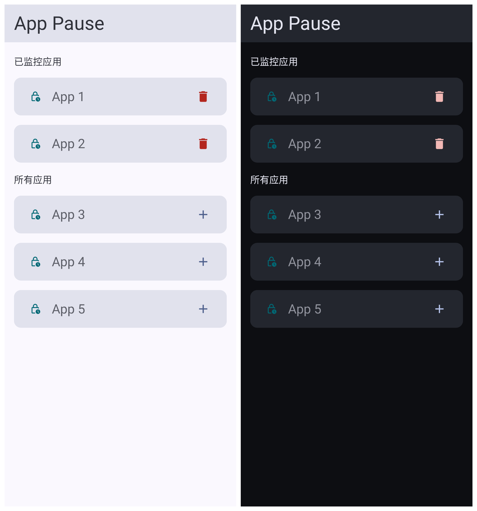
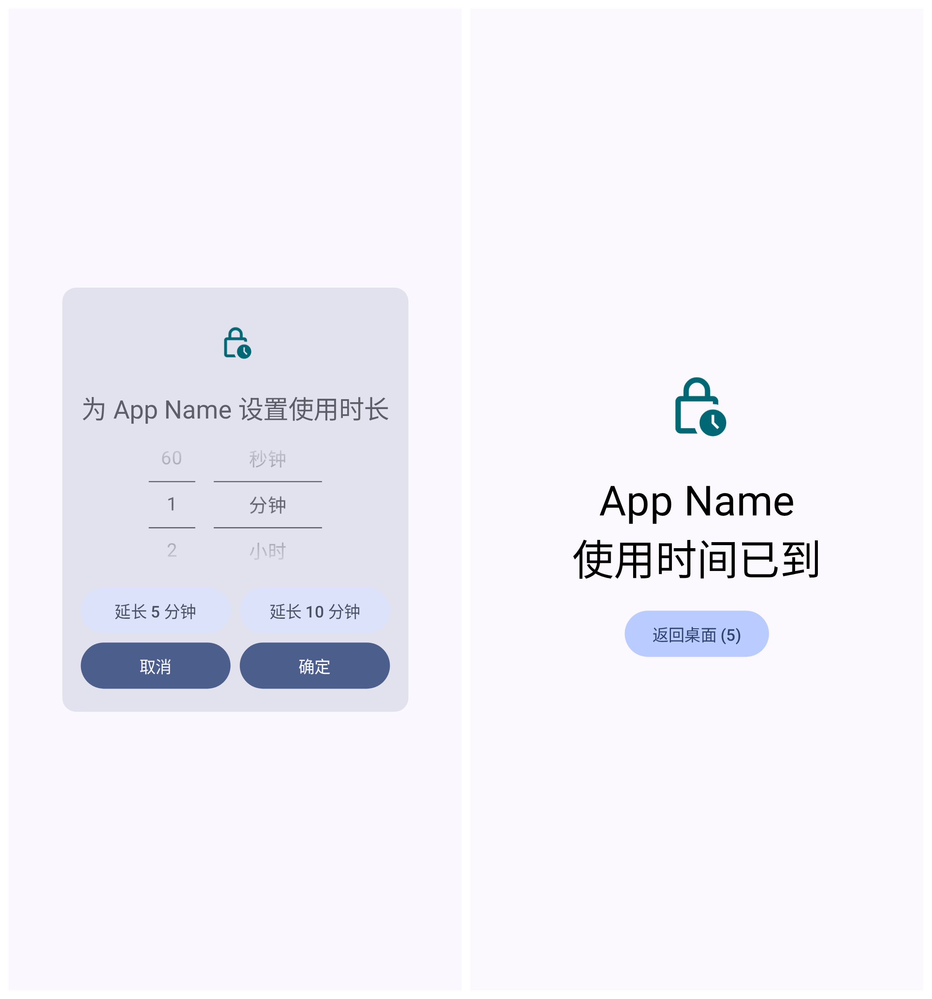
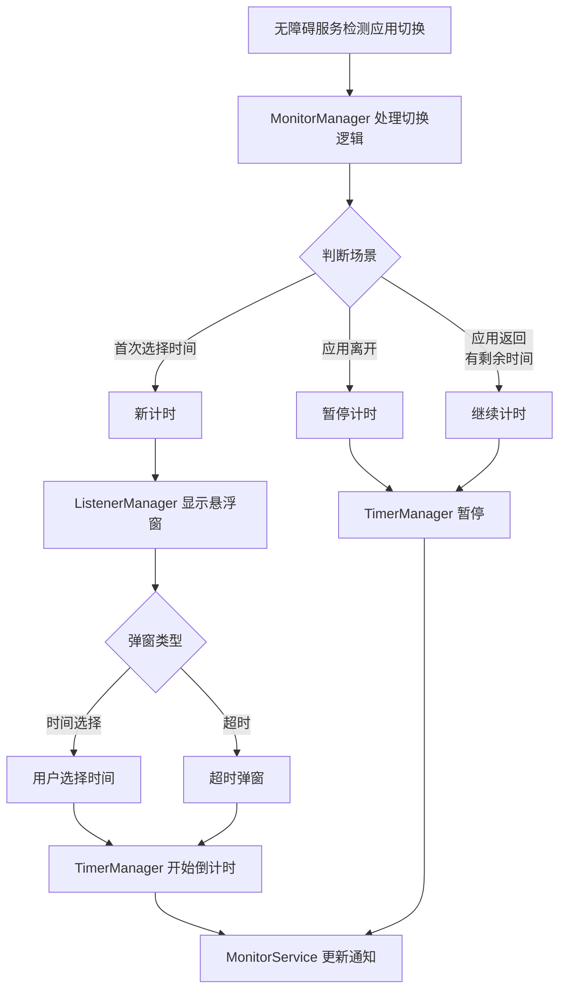

# **App Pause**

[](https://developer.android.com/jetpack/compose)




## **简介**

新一代 Android 应用使用时间管理工具，通过 Jetpack Compose 实现现代化交互界面，提供以下核心价值：

- 🕒 **灵活时段控制**：支持单次使用时长的动态调整
- 🎨 **沉浸式体验**：符合 Material Design 3 设计规范，支持深色/浅色主题
- 🔔 **智能提醒**：悬浮窗实时倒计时 + 通知实时更新倒计时
- 🛡️ **权限透明**：最小化权限请求，所有权限操作均有明确引导

## **核心功能**

### 实时倒计时

- 通知栏实时显示倒计时（精确到秒）
- 悬浮窗显示倒计时
- 暂停/继续状态自动切换

### 悬浮窗交互

- 时间选择弹窗：选择使用时长
- 超时弹窗：时间到提醒
- 渐入渐出动画效果（超时弹窗慢速渐入，打断用户）

### Toast 提示

- "开始倒计时"：首次选择时间
- "继续倒计时，剩余 X秒"：暂停后继续

## **技术架构** 🧱

### 核心组件

| 模块        | 技术实现                    | 特性              |
|-----------|-------------------------|-----------------|
| **UI 系统** | Jetpack Compose         | 声明式 UI + 状态驱动更新 |
| **状态管理**  | ViewModel + StateFlow   | 响应式状态管理         |
| **主题系统**  | Material Design 3       | 动态色彩 + 深色模式支持   |
| **悬浮窗**   | WindowManager + Compose | 可交互式浮动组件 + 动画   |
| **应用监控**  | AccessibilityService    | 实时应用切换检测        |

### 架构流程



## **开发指南** 👨💻

### 环境要求

- Android Studio Flamingo 2022.2.1+
- JDK 17
- Target SDK 34 (Android 14)

### 关键依赖

```gradle 
dependencies { 
    implementation "androidx.compose.material3:material3:1.2.0" 
    implementation "androidx.lifecycle:lifecycle-viewmodel-compose:2.6.2" 
    implementation "com.github.promeg:tinypinyin:2.0.3" }
```

### 代码结构

```
app/src/main 
├── java/com/huojieren/apppause 
│ ├── ui/ # Compose 组件 
│ │ ├── screens/ # 主界面/应用选择/监控列表 
│ │ ├── theme/ # 主题系统 
│ │ └── components/ # 可复用组件 
│ ├── managers/ # 功能模块管理 
│ │   ├── MonitorManager # 应用监控逻辑
│ │   ├── TimerManager # 倒计时管理
│ │   ├── OverlayManager # 悬浮窗管理
│ │   └── ListenerManager # 弹窗逻辑
│ └── models/ # 数据模型 
└── res 
    ├── mipmap-anydpi-v26/ # 自适应图标 
    └── values/ 
        ├── colors.xml # 兼容旧系统的颜色定义 
        └── theme/ # MD3 主题资源
```

### 静态分析

```bash
 ./gradlew detektCheck # Kotlin 代码规范检查 
 ./gradlew lintDebug # Android 项目静态分析
```

## **贡献指引** 🤝

我们欢迎以下类型的贡献：

- 🐛 错误报告：[新建 Issue](https://github.com/huojieren/AppPause/issues)
- 💡 功能建议：[查看 Roadmap](https://github.com/users/huojieren/projects/2)
- 📖 文档改进：直接提交 PR
- 🎨 UI/UX 优化：附上 Figma 设计稿

### 提交规范

```bash
git commit -m "feat(ui): add dark mode support" 
-m "Closes #123 #456" 
```

## **知识共享** 📚

特别感谢以下资源：

- Android 官方 Compose 示例
- Material Design 3 设计规范
- Jetpack 架构指南

以及 `通义灵码` 、 `DeepSeek` 、 `ChatGPT` 、 `Bing` 、 `OpenCode` 等大模型工具的大力支持
