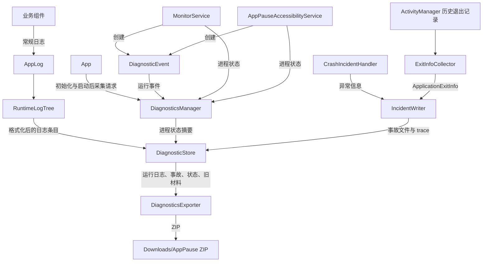
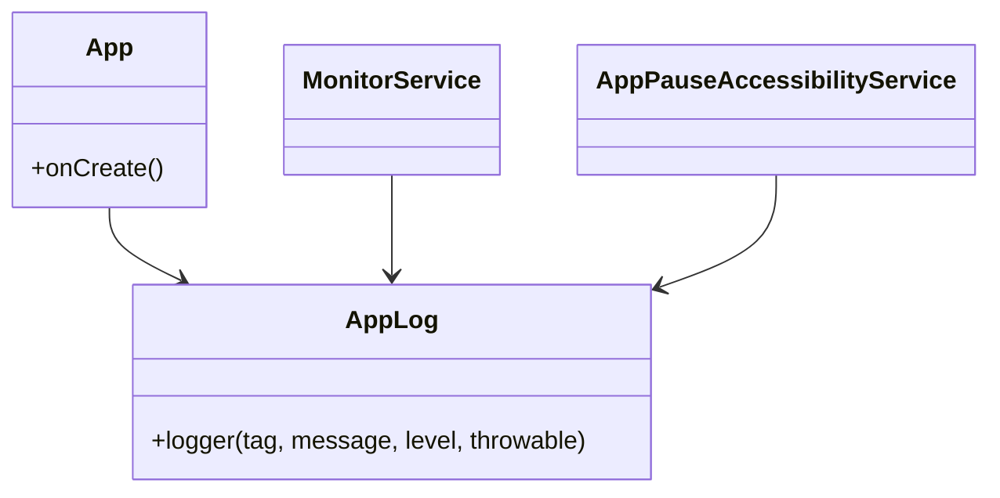
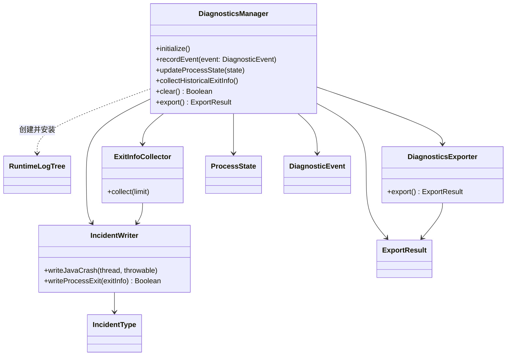
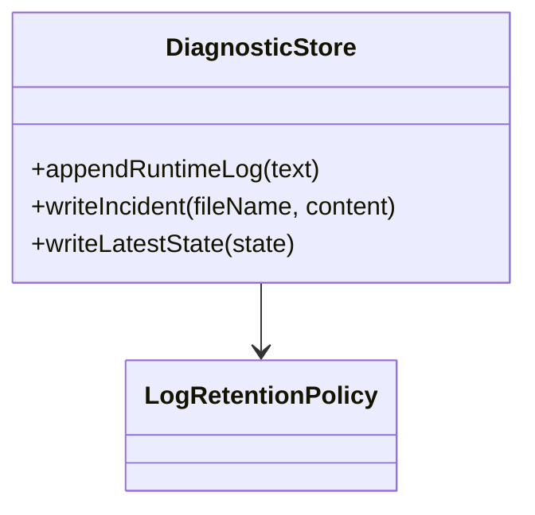
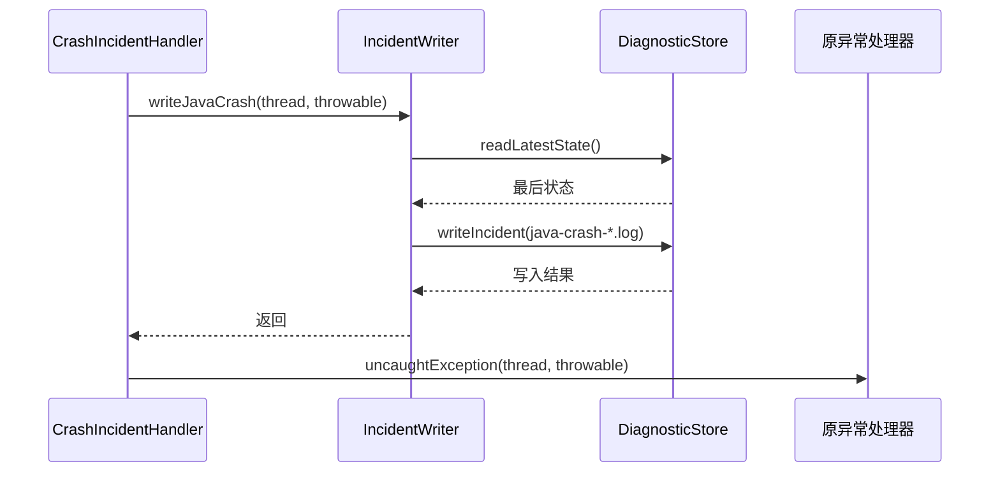
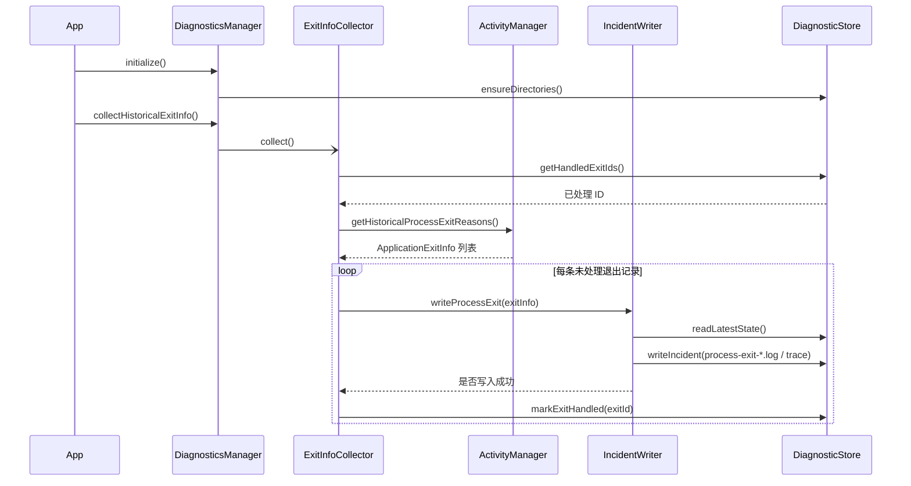

# 诊断系统架构

## 1. 概述

诊断系统负责保存应用运行期间的诊断材料，并在应用、前台监控服务或无障碍服务异常退出后提供可回溯的证据。系统以有界运行日志记录连续行为，以独立事故文件保存 Java 未捕获异常和 Android 历史进程退出信息，并在下一次进程启动时关联退出前的最后已知状态。

模块不承担进程保活职责。系统强制终止、低内存回收、ANR 和 native crash 均不保证应用回调执行；因此退出诊断依赖持久化状态与 Android 11（API 30）及以上的 `ApplicationExitInfo` 历史记录，而非退出回调或普通日志。

诊断材料存放于 `noBackupFilesDir`，导出时写入 Downloads/AppPause。文件写入、轮转和清理收敛在存储层，普通运行日志通过有界异步队列落盘，避免业务线程、前台服务和无障碍回调直接执行磁盘 I/O。

## 2. 数据定义

### 2.1 `DiagnosticEvent`

`DiagnosticEvent`（运行诊断事件）是 `DiagnosticsManager.recordEvent()` 的输入，用于标记服务和无障碍状态变化等可追溯行为。

| 字段         | 类型                  | 含义                                                      |
| ------------ | --------------------- | --------------------------------------------------------- |
| `name`       | `String`              | 稳定的事件名，例如 `monitor_service_started`。            |
| `attributes` | `Map<String, String>` | 可选的上下文属性，序列化为 `key=value` 形式附加到日志行。 |

事件不会单独生成事故文件。高频路径中的属性应保持简短，不包含用户数据或大对象。

### 2.2 `ProcessState`

`ProcessState`（进程状态摘要）表示关键状态转换后的最后已知状态。它写入 `state/latest-state.txt`；在 API 30 及以上还会写入 `ActivityManager.setProcessStateSummary()`，以便随系统退出记录返回。

| 字段                     | 类型      | 含义                         |
| ------------------------ | --------- | ---------------------------- |
| `source`                 | `String`  | 产生状态的组件或事件。       |
| `monitoring`             | `Boolean` | 当前是否处于监控状态。       |
| `accessibilityConnected` | `Boolean` | 无障碍服务是否已连接。       |
| `monitorServiceActive`   | `Boolean` | 前台监控服务是否活动。       |
| `monitorStrategy`        | `String?` | 当前监控策略；无策略时为空。 |

状态以紧凑的 `key=value` 文本保存，并限制写入系统摘要的字节数。状态摘要不应包含应用名、用户数据或敏感信息。

### 2.3 `IncidentType` 与事故文件

`IncidentType`（事故类型枚举）决定 `IncidentWriter` 创建的事故文件前缀和内容。

| 类型           | 文件前缀       | 触发来源                   | 主要内容                                                               |
| -------------- | -------------- | -------------------------- | ---------------------------------------------------------------------- |
| `JAVA_CRASH`   | `java-crash`   | 未捕获 Java 异常           | 线程、异常类型、消息、堆栈、最后状态。                                 |
| `PROCESS_EXIT` | `process-exit` | 历史 `ApplicationExitInfo` | 退出原因、状态码、内存指标、描述、系统状态摘要、最后状态与可用 trace。 |

主事故文件扩展名为 `.log`。系统退出记录存在 trace 时，额外保存 `.trace.txt`；API 31 及以上的 native crash 可保存 `.tombstone.pb`。退出记录使用时间戳、PID、原因和进程名组成的 ID 去重，已处理 ID 记录在 `state/handled-exits.txt`。

### 2.4 `ExportResult`

`ExportResult`（导出结果）是 `DiagnosticsExporter.export()` 的返回类型：

| 结果            | 含义                                           |
| --------------- | ---------------------------------------------- |
| `Success`       | ZIP 已成功写入导出目录。                       |
| `NoLogs`        | 没有可导出的运行日志、事故或旧版本材料。       |
| `Failed(error)` | 导出过程中发生异常，保留异常对象供调用方处理。 |

导出包名为 `diagnostics-yyyyMMdd-HHmmss.zip`，包含 `manifest.txt`、运行日志、事故文件与迁移期遗留材料。

## 3. 数据流



`DiagnosticsManager` 在应用启动时安装 `RuntimeLogTree` 和未捕获异常处理器，并异步启动历史退出采集。运行日志、状态、事故和迁移期遗留材料都由 `DiagnosticStore` 统一管理；导出器只读取现有材料，不额外触发采集。

## 4. 组件结构

### 4.1 职责

| 组件                  | 职责                                                             | 主要接口                                                                                                      |
| --------------------- | ---------------------------------------------------------------- | ------------------------------------------------------------------------------------------------------------- |
| `DiagnosticsManager`  | 诊断模块门面，协调初始化、事件、状态、历史退出采集、清理和导出。 | `initialize()`、`recordEvent()`、`updateProcessState()`、`collectHistoricalExitInfo()`、`clear()`、`export()` |
| `AppLog`              | 应用内统一日志入口，委托给 Timber。                              | `logger()`                                                                                                    |
| `DiagnosticEvent`     | 运行诊断事件及其上下文属性。                                    | `name`、`attributes`                                                                                           |
| `RuntimeLogTree`      | 格式化 Timber 日志并异步投递到存储层。                           | `log()`                                                                                                       |
| `DiagnosticStore`     | 文件布局、轮转、保留、原子写入、清理、导出文件枚举和旧文件兼容。 | 运行日志、状态、事故和旧文件存取方法。                                                                        |
| `IncidentWriter`      | 生成 Java crash 与系统进程退出事故文件。                         | `writeJavaCrash()`、`writeProcessExit()`、`exitId()`                                                          |
| `ExitInfoCollector`   | 在新进程启动后读取并去重历史退出记录。                           | `collect()`                                                                                                   |
| `DiagnosticsExporter` | 将现有诊断材料打包写入公共下载目录。                             | `export()`                                                                                                    |
| `LogRetentionPolicy`  | 集中定义运行日志、事故、去重 ID 和异步队列的上限。               | 保留策略常量。                                                                                                |

`DiagnosticsManager`、`DiagnosticStore`、`IncidentWriter`、`ExitInfoCollector` 和 `DiagnosticsExporter` 均为 Hilt 应用级单例。业务层不直接访问诊断文件，也不直接调用 `ApplicationExitInfo` 相关 API。

诊断代码按职责划分包：`data/logging` 提供全应用的 `AppLog`；`data/diagnostics` 保留 `DiagnosticsManager` 门面；`model` 存放 `DiagnosticEvent`、`ProcessState`、`IncidentType` 和 `ExportResult`；`runtime`、`incident`、`storage` 与 `export` 分别承载运行日志、事故、文件存储和导出实现。

### 4.2 应用层类图



`App`、`MonitorService` 和 `AppPauseAccessibilityService` 通过 `DiagnosticsManager` 进入诊断层；该跨层依赖不在应用层类图中展开。`AppLog` 仅提供应用层的统一日志入口。

### 4.3 诊断层类图



### 4.4 存储层类图



## 5. 存储与保留策略

主目录位于 `context.noBackupFilesDir/diagnostics/`：

```text
diagnostics/
├── runtime/
│   ├── app.log
│   └── app.log.1 ... app.log.5
├── incidents/
│   ├── java-crash-*.log
│   ├── process-exit-*.log
│   └── process-exit-*.trace.txt 或 tombstone.pb
└── state/
    ├── latest-state.txt
    └── handled-exits.txt
```

| 材料          | 策略                                               |
| ------------- | -------------------------------------------------- |
| 运行日志      | 单文件达到 5 MiB 后轮转；保留当前文件和 5 份备份。 |
| 事故文件      | 按最后修改时间保留最近 30 个文件。                 |
| 已处理退出 ID | 保留最近 100 个 ID。                               |
| 异步日志队列  | 最多暂存 512 条；队列满时丢弃最旧记录。            |

状态和事故文件先写入同目录临时文件，执行 `fsync` 后替换目标文件。`DiagnosticStore` 以同一把锁串行化写入、轮转、清理和导出文件枚举，避免并发操作覆盖文件。

新材料不写入 `filesDir` 或 `cacheDir`。导出时仍会读取旧版本的 cache/files 日志，以保留迁移期诊断信息。备份规则排除旧版本 `files/logs/` 和 `files/diagnostics/`；主目录位于 `noBackupFilesDir`，不会参与 Android Auto Backup 或设备迁移。

## 6. 代表性交互

### 6.1 Java 未捕获异常



异常处理器先委托 `IncidentWriter` 保存事故材料，再将异常交给原异常处理器。事故写入失败不会阻止原异常处理器继续终止进程。

### 6.2 启动后恢复历史退出记录



历史退出采集在专用线程池执行。API 30 以下不采集系统退出记录；同一退出记录仅在事故材料写入成功后才标记为已处理。

## 7. 导出

`DiagnosticsExporter` 收集运行日志、事故文件和仍存在的旧版本材料，生成 ZIP：

- ZIP 根目录包含 `manifest.txt`，记录包名和导出时间。
- API 29 及以上通过 MediaStore 写入 Downloads/AppPause，并使用 `IS_PENDING` 防止未完成文件对用户可见；失败时删除创建的媒体条目。
- API 29 以下写入公共 Downloads/AppPause 目录。

导出是只读操作，不会创建新日志、刷新进程状态或主动读取 logcat。

## 8. 运行边界

- `ApplicationExitInfo` 仅在 API 30 及以上可用，保留数量、退出原因和 trace 可用性由系统及设备决定。
- 运行日志采用异步、有界队列，进程被强制终止时不保证最后一条日志已经落盘；最后状态和历史退出记录用于补充这一窗口。
- `onInterrupt()` 表示无障碍反馈中断，不表示服务解绑；无障碍断连状态在 `onUnbind()` 记录。
- 普通服务销毁、解绑和状态变化记录为运行事件，不单独生成事故文件。
- 系统 logcat 不属于自动事故采集路径；如需扩展系统级材料，应通过用户主动触发的诊断导出流程处理权限、隐私和失败降级。
